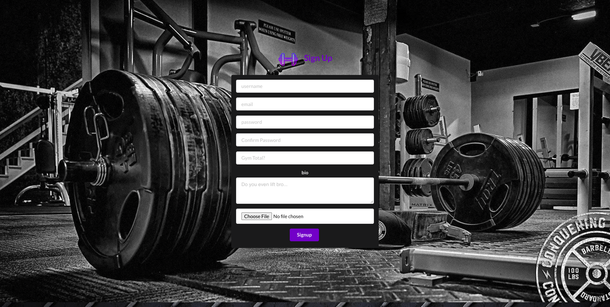
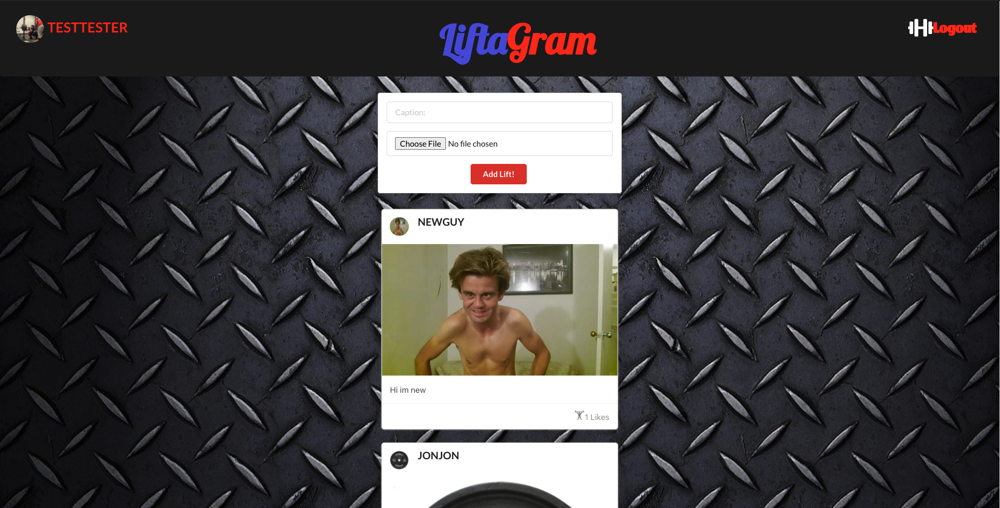
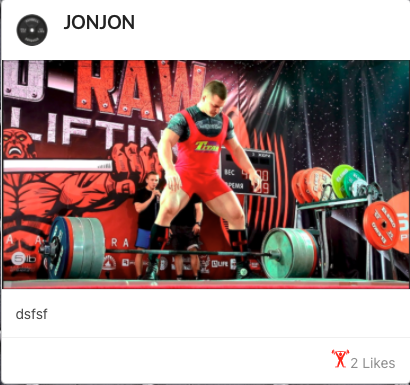

# 

---
---

## Table Contents  
* [Overview](#overview)
* [Getting Started](#getting-started)
* [Technologies Used](#technologies-used)
* [Screenshots](#screenshots)
* [Development](#development)  
  * [Planning](#planning)
  * [Coming Soon](#coming-soon)
---
---

## Overview

*LiftaGram* (Instagram inspired) is an American photo sharing social networking service created with Lifters in mind by Justin TuiSamoa. In April 2021. The app allows users to upload Photos that can be captioned with. Posts can be shared publicly or with other lifters who havew signed up. Users can browse other users' content by visiting their profile pages and users can like photos and see other users posts and like their content you see on your post feed.

---
---

## Getting Started  
Here is the link for
[LiftaGram](https://liftagrams.herokuapp.com/)  

---
---

## Technologies Used  
* Frontend
  * Javascript
  * HTML
  * CSS
  * React
  * Semantic UI
* Backend
  * Node.js
  * Express.js
  * MongoDB/Mongoose.js
* Services
  * AWS
  * Atlas
  * Heroku
* Most Importantly
  * Google

---
---
## Screenshots

#### Landing Page simply shows the signup
 
#### Home Page gives site info and some community posts
 
#### Update Profile Photo
 
#### Like Photo, add a rep
 
 

---
---
## Development  
### *Planning*:  
View the 
[Trello](https://trello.com/b/ki8REnYJ/liftagram) board with wireframes and ERD. 

---
### *Coming Soon*:
* Allow users to follow each other
* Messaging system
* Video uploads
* World Domination
